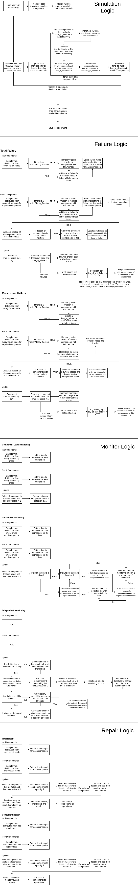

Logic Diagram
=================================

Here is a set of diagrams to understand how the simulation runs. Each module has a set of functions: init, reinit, and update. Init describes the logic to handle the initial creation at the beginning of the simulation. Reinit describes how to reinitialize components that are repaired. Update gives the logic of what happens on each day of the simulation.

